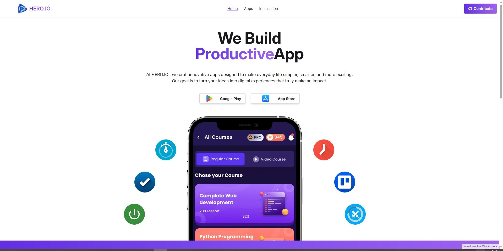
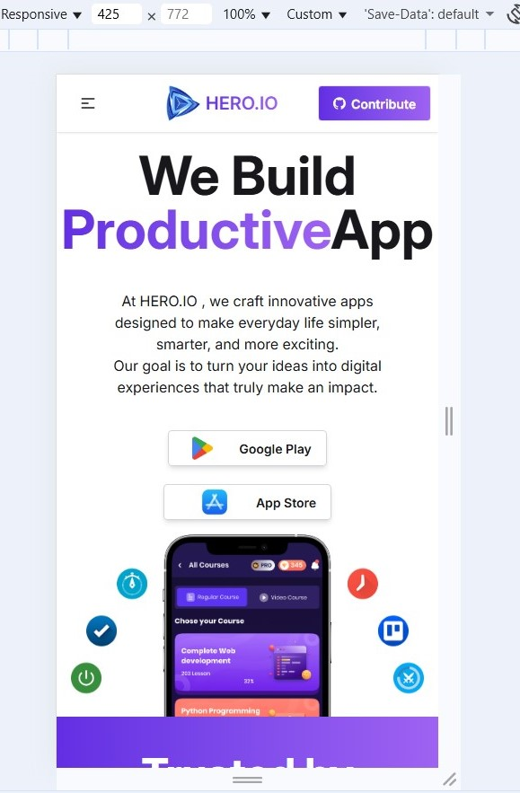

# Project name: My Smart Applicatons

 
 
- [project-app-pic](./public/assets/SharedScreenshot-02.jpg)
- [project-pic](./public/assets/SharedScreenshot-03.jpg)

## Description
 This is a responsive front-end web project designed to modern UI design and clean code practices. This project was created as part of my learning journey in my front-end web development.

## Technologies
 - HTML5 - for structuring the web pages
 - Tailwind CSS, DaisyUI - for styling and responsive design
 - JavaScript (ES6) - for interactive functonality
 - React Router - use for React applications to handle  navigation between pages without reloading the browser.
 - Netlify - for deployment project
 - Git & GitHub - for version control

